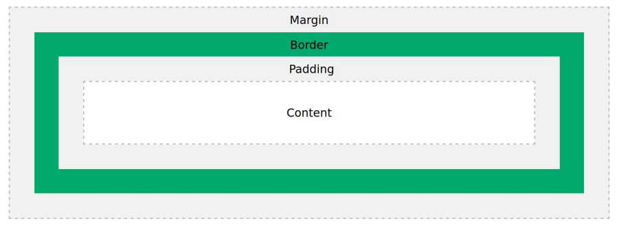
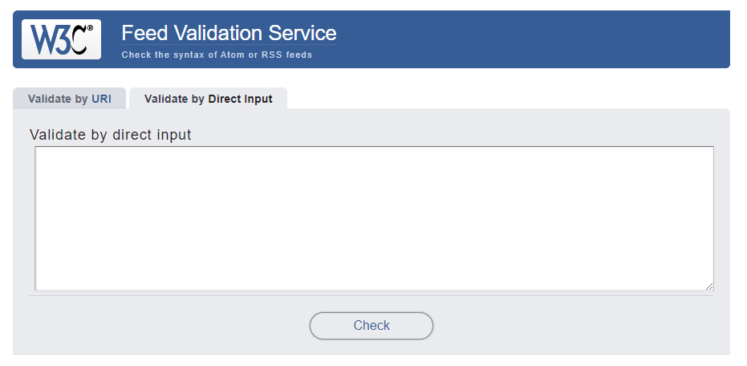

# Cuaderno lenguaje de marcas
## Tabla de contenidos
* ### [¿Qué es un lenguaje de marcas?](#qué-es-un-lenguaje-de-marcas-1) 
* ### [Evolución de los lenguajes de marcas](#evolución-de-los-lenguajes-de-marcas-1)
* ### [Características de los lenguajes de marcas](#características-de-los-lenguajes-de-marcas-1)
* ### [Ejemplos y características de diferentes lenguajes de marcas](#ejemplos-y-características-de-diferentes-lenguajes-de-marcas-1)
* ### [XML: definición y caracteristicas del metalenguaje](#xml-definición-y-caracteristicas-del-metalenguaje-1)
* ### [Documento XML](#documento-xml-parte-del-tema-2)
* ### [Sistemas de Gestión de Información](#sistemas-de-gestión-de-información-1)
* ### [Sindicación de contenidos web](#sindicación-de-contenidos-web-1)

## ¿Qué es un lenguaje de marcas?
* Un lenguaje de marcas, es aquel que permite representar información que contiene, además de los datos, marcas o etiquetas que indican cómo se estructuran estos datos, su significado o cómo debe representar desde un punto de vista gráfico y visual.
 

## Evolución de los lenguajes de marcas
* [GML](GML.md)
* [SGML](SGML.md)
## Características de los lenguajes de marcas
* **Uso del texto plano**: Al ser un texto plano cualquier persona puede leer y editar esa información.
* Es un **lenguaje compacto**: Las etiquetas de marcas se mezclan con el contenido del mismo.
* **Independencia del dispositivo**: Al ser independiente del dispositivo nos permite mostrar el contenido.
* **Facilidad de procesamiento**: Permite el desarrollo de lenguajes especializadas según el tipo de documento que necesitemos procesar.
* **Flexibilidad**: Posibilidad de combinación con otros lenguajes.
* Muy **ordenados**
## Ejemplos y características de diferentes lenguajes de marcas
* [XML](XML.md)
* [HTML](HTML.md)
* [JSON](JSON.md)
* [YAML](YAML.md)

## XML: definición y caracteristicas del metalenguaje
### Prólogo
El prólogo de un documento XML tiene la siguiente estuctura.
``` XML
<?xml version="1.0" encoding="utf-8" standalone="no"?>
```
Aunque no es obligatorio indica informacion relativa al propio documento.

Puede contener los siguientes elementos:
* **version**: indica la versión de XML que estamos usando.
* **encoding**: indica la codificación escrita en el documento
* **standalone**:  indica la existencia de un esquema XML(DTD) en el propio documento o externo.
### Etiquetas
En un lenguaje de marcas se pueden econtrar unas etiquetas
* Una etiqueta en XML debe tener un inicio y un final que será una palabra entre los símbolos "<" ">"
* Siempre debe haber una etiqueta de cierre "</"
* Las etiquetas pueden tener atributos.
* Un elemento es el par de etiqueta de apertura y de cierre.
* Dentro de un elemento puede encontrarse texto u otros elementos.
* En un documento XML solo puede haber un elemento raiz.
* Pueden añadirse comentarios entre los símbolos ```<!-- y -->```.
### Atributos
En una etiqueta XML puede encontrarse atributos.
* Un atributo en XML, es una información adicional que se le da a una etiqueta en concreto
* Comienza con una palabra, seguido del símbolo "=" y la información entre comillas dobles "".
* Una etiqueta puede tener 0 o más atributos.
* Cada atributo tendrá solo información, no puede como contener como tal otros atributos.
### Ejemplos de XML
``` XML
<pizzas>
    <pizza nombre="Barbacoa" precio="8">
        <ingrediente nombre="Salsa Barbacoa"/>
        <ingrediente nombre="Mozzarella"/>
        <ingrediente nombre="Pollo"/>
        <ingrediente nombre="Bacon"/>
        <ingrediente nombre="Ternera"/>
    </pizza>
    <pizza nombre="Margarita" precio="6">
        <ingrediente nombre="Tomate"/>
        <ingrediente nombre="Jamón"/>
        <ingrediente nombre="Queso"/>
    </pizza>
</pizzas>
```
``` XML
<poema fecha="Abril de 1915" lugar="Granada">
    <titulo>Alba</titulo>
    <verso>Mi corazón oprimido</verso>
    <verso>late junto a la alborada</verso>
    <verso>el dolor de sus amores...</verso>
</poema>
```
``` XML
<recetas>
    <receta>
        <tipo definicion="postre"/>
        <dificultad>Fácil</dificultad>
        <nombre>Tarta de chocolate</nombre>
    </recetas>
    <ingredientes>
        <ingrediente nombre="Cola-Cao" cantidad="250 gramos"/>
        <ingrediente nombre="mantequilla" cantidad="200 gramos"/>
        <ingrediente nombre="harina" cantidad="1 vaso"/>
        <ingrediente nombre="azúcar" cantidad="1 vaso"/>
        <ingrediente nombre="huevos" cantidad="3"/>
    </ingredientes>
</recetas>
```
## Documento XML (Parte del tema 2)
* ### Declaración (prólogo)
    Es un elemento opional que se incluye al inicio del documento.
    
    Empezará y acabará por:
    
    ```<?xml y acaba por ?>```
    y podrá contener los siguientes atributos:
    * _Version_: Versión de XML.
    * _encoding_: Codificación del documento.
    * _standalone_: Indica si el documento es independiente o si existe un DTD externo. Admite valores "yes" o "no" para indicar si existe dicho vocabulario.

    DTD: _Document Type Definition_: contiene las reglas que determina que un documento XML es válido.
* ### Elementos 
    Un documento XML se compone por una serie de elementos.
    * Un elemento tiene un nombre que se diferencia entre mayusculas y minusculas.
    * Comienza por ```<nombre>``` y termina por ```</nombre>```. Debe ser iguales en su apertura y cierre.
    * Los nombres de los elementos deben caracteres alfanuméricos, guiones, guines bajos o punto (sin espacios).
    * Debe haber un único elemento inicial llamado raíz (aunque puede llamarse como queramos).
    * Dentro de un elemento, puede haber más elementos o texto.
    * Si un elemento está vacío puede escribirse como ```<nombre/>```

    Existen las siguientes relaciones.
    * Un único elemento raíz (root).
    * Cada uno de los elementos descendientes de un elemento, se llaman hijos (children).
    * El elemento ascedente de un elemento, se llama padre (parent).
    * Los elementos que tienen un padre común se denominan hermanos (sliblinng).
* ### Atributos
    Un documento xml se compone por una serie de elementos.
    * Deben tener asignado un valor.
    * Los valores siempre van entre comillas(simples o dobles).
    * Diferencian entre mayúsculas y minúsculas.
    * Comienzan por una letra o guión bajo.
    * Los atributos siempre están dentro de la etiqueta de apertura de un elemento.
* ### Comentarios
    Un comentario en XML, es un elemento, que no va a ser procesado; sirve para mostrar información al usuario para entender el contexto del documento u otra información.

    ```<!-- y acaba acaban por -->```
* ### Espacios de Nombres
    El espacio de nombres o namespace, es un identificador que se utiliza para resolver las ambigüedades que podrían surgir cuando hay dos o más elementos iguales.

    La declaración de un espacio de nombres se realiza con el atributo xmlnes seguido por el nombre y una URL.
```XML
<?xml version="1.0" encoding="utf-8" ?>
<root xmlns:e="https://example.com/e/">
    <!--Comment-->
    <e:element1>text</e:element1>
    <e:element2>text2</e:element>
</root>
```
* ### Entidades 
    Las entidades en XML, permiten incluir información predefinida en un documento.
    * Pueden ser definidas en el propio DTD o que sean externas.
    * Empiezan por & y finalizan por;
    * Se pueden clasificar por:
        - Generales (Forman parte del documento)
            - Internas (Son predefinidas y mantienen su valor),
            - Externas (Mantienen los valores en un fichero externo).
        - Entidades de parametros (Se transforman en DTD). 
 Existen 5 entidades generales predefinidas internas.
            
 | Entidad |   Descripción  | Carácter |
|:-------:|:--------------:|:--------:|
| &li;    | Menor que      |        < |
| &gt;    | Mayor que      |        > |
| &amp;   | Ampersand      |        & |
| &apos;  | Comilla simple |        ' |
| &quot;  | Comilla doble  |        " |

* ### CDATA
    En XML, una sección CDATA es un conjuto de caracteristicas que no debe ser tratado por el analizador, pero si formará parte de la información (a diferencia de un comentario).
    * Comienza por ```<![CDATA[.```
    * Acaba con ``` ]]>```

Ejemplo de CDATA:
```XML
<?XML version="1.0" encoding="utf-8" ?>
<root xmlns:e="https://example.com/e/">
    <!--Comment-->
    <e:element1>text</e:element1>
    <e:element2><![CDATA[
        <html>
            <head>
            </head>
            <body>
                <h1>Encabezado </h1>
            </body>
        </html>
        ]]>
    </e:element2>
</root>
```

## Validación de documentos
Un documento está validado, si además de estar bien formado, si está escrito conforme a las reglas definidas en su DTD o conforme un XML Schema.

* [DTD](DTD.md)
* [XML Schema](XMLSch.md)

## Sistemas de Gestión de Información
Un sistema de gestión de infotmación, son esos programas informáticos, diseñados para dar soporte a cualquier de los procesos que se realizan en una empresa.
Esto permite poder mejorar sus procesos y obtener un mayor beneficio en su actividad.


### En un sistema de gestión de Información existen:
* Sistema de gestíon de información local 
* Sistema de gestíon de información en la nube

### Hay distintos tipos de Sistemas de Gestión de Información:
* [ERP](ERP.md)
* [CRM](CRM.md)
* [BI (Busine Intelligence)](BI.md)


## HTML
### HTML y su evolución
HTML fe diseñado inicialmente en el año 1991 como parte del CERN, ha tenido varias versiones y diferentes implementaciones;

 | año |   Versión  | Observaciones |
|:-------:|:--------------:|:--------:|
| 1991    | Diseño inicial  |Incluye 18 etiquetas se considera dialecto SGML.|
| 1992    | HTML 1.1      |Primer Borrador|
| 1995   | HTML 2.0      |Recomendación W3C|
| 1997  | HTML 3.2 |Recomendación W3C|
| 1997  | HTML 4.0  |Recomendación W3C|
| 1999  | HTML 4.1  |Recomendación W3C|
| 2000    | XHTML     |Publicado como  recomendación del W3C. Tiene como objetivo sustituir a HTML pero se desarrolló el estándar HTML 5 por otro lado.|
| 2014   | HTML 5.0      |Recomendación W3C|
| 2016  | HTML 5.1 |Recomendación W3C|
| 2017  | HTML 5.2 |Recomendación W3C|
## XHTML
XHTML es un estándar que extiende HTML con las propias caracterísitcas del metalenguaje XML. Por ello, sigue las mismas reglas del mismo a diferencia de HTML.

Tiene una estructura similar al propio HTML pero con algunas diferencias:
* Las etiquetas deben estar bien anidadas.
* Todas las etiquetas deben estar cerradas.
* Todas las etiquetas y atibutos van en minúscula.
* No puede haber texto sin estar dentro de una etiqueta.
* Los scripts y estilos deben ir dentro de un CDATA.

# HTML
## Estructura de HTML 
Veamos la estructura de un documento HTML: 
```HTML
<!DOCTYPE html>
<html>
<head>
 <meta charset='utf-8'>
 <meta http-equiv='X-UA-Compatible'
content='IE=edge'>
 <title>Page Title</title>
 <meta name='viewport'
content='width=device-width,
initial-scale=1' >
 <link rel='stylesheet' type='text/css'
media='screen' href='main.css'>
 <script src='main.js'></script>
</head>
<body>

</body>
</html>
```
Podemos Observar:
* Doctype para validar el documento.
* Cabecera.
* Cuerpo.
* Etiquetas tanto de apertura como de cierre.

## Cabecera HTML
**Title**
Indica el título de la página; esto es importante para informar al usuario de que contenido tiene y visualizarlo en el navegador. Esta etiqueta es Opcional.
```HTML
<html>
    <head>
        <title> Mi página </title>
    <head>
</html>
```
* ### Meta
    * charset: Codificación del juego de caracteres. Por ejemplo UTF-8.
    * http-equiv: Especifica una directiva. Lo veremos en la siguiente diapositiva.
    * name: Nombre del metadato.
    * content: Valor asociado a atributos como name y http-equiv; depende del nombra del atributo.
    * Content-Type: Indica el tipo de contenido, y el juego de caracteres.
    * Cache-control: Especifica cómo ha de gestionar el navegador la caché de la web.
    * refresh: Indica al navegador que pasado un tiempo ha de refrescar la página.
    * robots: Indica a los motores de búsqueda donde se encuentra el fichero robots.txt o que páginas no deben ser indexadas.
    * Keywords: Indica a los motores de búsqueda las palabras clave de la pagina.
    * author: Indica el autor de la página.
    * copyright: Indica el propietario de los derechos de la web.
    * ViewPort: Indica el ancho de la zona a representar de la página.
* ### Style
Esta etiqueta permite establecer el estilo utilizando el lenguaje de marcado CSS.
```HTML
<html>
    <head>
        <style>
            p { font-size: 5em;}
        </style>
    </head>
</html>
```
* ### Link
Esta etiqueta permite establecer una relación con un elemento externo
```HTML
<html>
    <head>
        <style>
            <link href="style.css" rel="stylesheet"/>
        </style>
    </head>
</html>
```

Donde:
* href: Indica la dirección del recurso externo.
* rel: Indica la relación del recurso externo con el documento.

* ### Script
Permite añadir un Script de código ejecutable, como puede ser JavaScript.
Puede contener el código o referenciar un recurso externo.
```HTML
<html>
    <head>
        <script> alert("hola"); </script>
    </head>
</html>

<script src="js/main.js"/>
```

## Cuerpo HTML
Uno de los elementos principales de HTML es el cuerpo o body, es donde se mostrarán todos los datos que serán representados al usuario.
```HTML
<html>
    <head><title>Mi pagina</title></head>
    <body>
        <!-- Elementos a representar -->
    </body>
</html>
```
Dentro del cuerpo de HTML podemos encontrar dos tipos de etiquetas o elementos:
* Elementos de Bloque: Ocupan todo el espacio de su elemento padre(contenedor) y salvo excepciones permiten contener otros elementos.
* Elementos de línea: Ocupan sólo el espacio que ocupan su contenido, contienen datos u otros elementos de línea.
### Elementos de bloque
Otro de los elementos que podemos encontrar en el cuerpo de un documento HTML, son los elementos de bloque.
* [Elementos de Bloque](ElementoBloque.md)
### Elementos de Línea
Los elementos de línea son aquellos que solo ocupan el espacio del propio contenido, independiente del contenedor.
* [Elementos de Línea](ElementoLinea.md)
### Listas, Tablas y Formularios

* [Listas, Tablas y Formularios](ListasTablasYFormularios.md)
### Elementos multimedia
Una de las principales mejoras que trae HTML5, es que se han
añadido diferentes elementos para trabajar con información multimedia; de tal
forma que la web sea más interactiva.
* [Elementos multimedia](ElementosMultimedia.md)

# CSS
Normalmente, además de HTML se utiliza otro lenguaje de marcas que ya hemos
mencionado anteriormente como CSS (Cascade Style Sheets).

CSS permite añadir estilo a un documento web para poder mejorar la presentación de la información.

CSS es mantenido por la W3C al igual que HTML y XML. Comenzó en 1996 y hoy en día es indespensable para cualquier página web.

| año |   Versión  | Descripción |
|:-------:|:--------------:|:--------:|
| 1996    | CSS1  |El W3C ya no soporta esta versión|
| 1998    | CSS2      |El W3C ya no soporta esta versión|
| 2011   |  CSS2.2      |Correción de errores de CSS2|
| 2012  | CSS3 |Esta gestión la divide en módulos. Por lo que no hay fecha de cambio.|

La sintaxis de CSS se divide en:
* Selectores: Herramientas que permiten seleccionar el elemento o elementos
sobre los que aplicar reglas.
* Declaraciones: Son las reglas para aplicar estilos a los distintos elementos, normalmente tienen una estructura clave valor.
* Comentarios: Se aplican entre los caracteres /* */.

Ejemplo de CSS:
```CSS
body{
 color: green;
}
```
### Agregar CSS
Para añadir CSS a un documento HTML, podemos hacerlo de las siguientes formas:
1. Como Documento externo usando una etiqueta link.

```<link rel=”stylesheet” href=”estilos.css” >```

2. Como elemento style dentro de la cabecera del documento.

```<style>…</style>```

3. Como elemento en línea usando el atributo style.

```<p style=”color:white”>...</p>```

### Prioridad al usar CSS
Cuando hay una o varias reglas que se superponen en diferentes elementos se
aplican las siguientes prioridades que se aplican en cascada:
* Origen e importancia: Primero se tienen en cuenta los estilos propios por
encima de los del propio navegador.
* Nivel de especificidad: Contra más específico más importante.
* Orden de aparición: Los últimos estilos en leerse tienen más prioridad.

Además, podemos establecer la máxima prioridad utilizando el modificador
```!important```.

También se pueden establecer una serie de valores para cada regla, para
reestablecer la prioridad:
* inherit: Activa la herencia, haciendo que la propiedad sea asignada con el
valor heredado del elemento padre.
* initial: El valor tomado será el valor por defecto.
* unset: Reestablece el valor a su valor natural.
* revert: Reestablece el valor de la propiedad al valor que habría tenido si no se hiciese cambio.
### Tipos de Datos y Unidades
En CSS podemos encontrar los siguientes tipos de datos:
* Entero: Números enteros positivos y negativos.
* Número: número decimal.
* Dimensión: un número con con una dimensión asociada; puede ser deg
(grados), s(segundos) o px(píxeles).
* Porcentaje: Indica un porcentaje o fracción se indica con el símbolo %.
* Colores: indican un color que puede ser uno predeterminado (green, red,
white…) valor RGB (rgba(22,33,11,20)), hexadecimal (#112233) o HSL (Hue
Saturation Lightness) (hsl(0,100%,50%)).

Por otro lado, existen diferentes Unidades que pueden clasificarse en Absolutas o relativas.

Unidades Absolutas:
* px: píxeles.
* cm: centímetro.
* mm: milímetro.
* Q: Cuarto de milímetro.
* in: Pulgada
* pt: Puntos (1/72 in).
* pc: Picas (1/16 in).

Unidades Relativas:
* em: Tamaño letra del padre.
* ex: Altura de la fuente del elemento.
* ch: Ancho del carácter.
* rem: Tamaño de letra del elemento Raíz.
* lh: Altura de la línea del elemento.
* vw: 1% del ancho de ventana gráfica.
* vh: 1% del alto de la ventana gráfica.
* vmin: 1% de la dimensión más pequeña de la ventana gráfica.
* vmax: 1% de la dimensión más grande de la ventana gráfica.
### Selectores
Como hemos comentado, un selector no es más que una regla para seleccionar
uno o varios elementos que modificarán sus reglas; podemos dividirlos en los
siguientes tipos:
* Universal: selecciona todos los elementos; ejemplo: *
* Tipo: Tipo de elemento: ejemplo: h1.
* Clase: elementos de una determinada clase: .clase.
* Identificador: elemento con un identificador en concreto; ejemplo:
#elemento.
* Atributo: elemento con un atributo en concreto; por ejemplo:
input[type=”submit”].

También podemos realizar combinaciones o agrupaciones:
* Agrupación: aplicará las reglas a todos esos elementos o clases; ejemplo:
h1,h2,h3.
* Combinación: indica que sólo aplicará a la combinación de varios elementos;
podemos clasificarlos en los siguientes casos:
    * Hermanos: Elemento hermano a otro; ejemplo: A~B.
    * Hijos: Elemento Hijo a otro; ejemplo: A>B.
    * Hermanos adyacentes: Elemento hermano a otro pero adyacente; ejemplo: A+B.
    * Descendientes: Elemento descendente;Ejemplo A B.
### Pseudoclases
Una pseudoclase es un modificador que se añade a un selector para que solo se
aplique cuando dicho elemento pase a un estado específico, normalmente se
establece con la siguiente sintaxis:

```CSS
selector:pseudoclase{
color: white;
}
```
Algunas de las pseudoclases son:
* active: cuando el elemento está activo.
* checked: cuando un checkbox está activo.
* disabled: cuando el elemento está deshabilitado.
* focus: Cuando el elemento tiene el foco.
* hover: Cuando el ratón pasa por encima.
* visited: Cuando el enlace apunta a una dirección ya visitada
anteriormente.

### Pseudoelementos
Un Pseudoelemento se añade a un selector para establecer el estilo de parte de dicho elemento; por ejemplo la primera letra o palabra; Los pseudoelementos
pueden ser:
* after: Permite añadir contenido después del elemento.
* before: Permite añadir contenido antes del elemento.
* first-letter: Primera letra del primer bloque de texto.
* first-line: Primera línea del primer bloque de texto.
* selection: Modificar el estilo cuando hay parte del contenido
seleccionado.
### Propiedades CSS
Una vez hemos visto los distintos selectores, vamos a ver algunas de las reglas más importantes de CSS.

Comenzaremos con ver las dimensiones del modelo de cajas. Algunas de las características son:
* Margen exterior: espacio circundante con otros elementos; se establece con la propiedadmargin.
* Margen Interior: espacio interior vacío que se agrega al elemento; se establece con la propiedad padding.
* Borde: Espacio que tiene distintos rellenos y diferentes colores; se establece con la propiedad border; aunque tiene diferentes variantes.
* Contorno: Se dibuja encima del elemento sin ocupar espacio; se establece con la propiedad outline.
* Ancho: ancho del elemento; se establece con la propiedad width.
* Alto: Alto del elemento: se establece con la propiedad height.

### Modelos de cajas

### Display
Una de las propiedades más importantes es display; que permite establecer cómo se
mostrarán los elementos; algunos de los valores que permite son:
* **block**: indica que se mostrará como un bloque (ocupando todo el espacio
disponible).
* **inline**: Indica que se mostrará en línea (ocupando solo su contenido).
* **flex**: Se mostrará como un bloque pero establece el modelo denominado flexbox;
estableciendo una dirección por la que fluye. Se utiliza la propiedad
flex-direction, para ver en qué dirección fluirá
* **grid**: Se mostrará como bloque pero establece una cuadrícula. Se utiliza la propiedad
grid-template-columns para establecer la cuadrícula y sus dimensiones.
### Flex
```CSS
.container-flex{
    display: flex;
    flex-direction: column;
}
.container-flex div{
    padding: 5px;
    margin: 5px;
}
.container-flex p{
    text-align: center;
}
```
### Grid
```CSS
.container-flex{
    display: grid;
    grid-template-columns: 50% 50%;
}
.container-flex div{
    padding: 5px;
    margin: 5px;
}
.container-flex p{
    text-align: center;
}
```
### Float
Se puede establecer el comportamiento de dónde aparecerán los elementos y su
contenido con la propiedad float. 

Tiene los siguientes valores:
* left: empuja al elemento a la izquierda.
* right: empuja al elemento a la derecha.
* none: no empuja al elemento.
* inherit: hereda el valor de la propiedad float del elemento padre.

### Position
También es importante ver que la posición de un elemento pueda ser dependiendo
de su contenedor o por el mismo con la propiedad position. 

Tiene los siguientes valores:
* static: valor por defecto; se posiciona siguiendo el flujo normal.
* relative: Permite establecer su posición de forma relativa al anterior elemento.
* absolute: Establece la posición absoluta con respecto al documento.
* fixed: El elemento deja de seguir el flujo normal del documento.
* Sticky: EL elemento se posiciona siguiendo el flujo normal y se pueden
establecer la posición límite con su contenedor.

### Propiedades de texto
Podemos establecer una serie de propiedades para dar formato al texto:
* color: color del texto.
* font-family: el tipo de letra; se establece como una lista con prioridad.
* font-size: Tamaño del texto.
* font-weight: Determina el grosor del trazo.
* text-align: Determina la alineación del texto; tiene los valores: left,
right, center y justify.
* letter-spacing: espacio entre letras.
### Propiedades de lista
Algunas de las propiedades que podemos establecer las listas son:
* list-style-type: Indica el tipo de viñeta a utilizar; tiene los valores: disc,
circle, square, decimal, lower-roman, upper-roman,
lower-greek, lower-latin, lower-latin y none.
* list-style-position: establece la posición de las viñetas; puede ser
inside u outside.
* list-style-image: Establece una viñeta como una imagen pasando una
URL.
### Diseño adaptativo o Responsive
Hoy en día existen muchos dispositivos capaces de navegar por la web, desde ordenadores, tablets, dispositivos móviles e incluso ya gafas de realidad aumentada.

Es por ello que se necesita adaptar el CSS para cada pantalla; por lo que se utilizan las llamadas media
queries, que permiten seleccionar una serie de reglas dependiendo del tamaño de la pantalla.

```CSS
@media screen and (min-width: 480px) {
 body {
 background-color: lightgreen;
 }
}
```
# Sindicación de contenidos web
Dado a que hay muchisima información y no es facil dar a conocer nuestro contenido.
Por ello se pueden utilizar herramientas de sindicación de contenidos para poder difundir esta información.
## Sindicación de contenidos
Los sistemas de redifusión web o sindicación web permite liberar de trabajo a los usuarios al proporcionar un mecanismo de suscripción con el cual la información llega a los usuarios en vez de tener que buscarla.

Algunos de estos sistemas se basan en canales de redifusión llamados **fuente web, canal web o web feed**.

Una fuente web es un documento que contiene información básica sobre elementos de información incluyendo referencias para acceder a estos elementos.

Existen varios formatos, como pueden ser **Atom** o **RSS**.

* [RSS](RSS.md)
* [Atom](Atom.md)

## Validar Canales
Se pueden utilizar validadores para ver si realmente nuestro canal de sindicación funciona correctamente, como por ejemplo el ofrecido por la w3c:


[https://validator.w3.org/feed/#validate_by_input](https://validator.w3.org/feed/#validate_by_input)

## Añadir a una web
Los ficheros RSS o Atom, pueden ser añadidos a una web HTML, usando un enlace ```<a>``` como si de un fichero se tratara.
Aunque existe otra manera, y es mendiante la etiqueta ```<link>``` en la cabecera ```<head>```.
```HTML
<link href="atom.xml" type="application/atom+xml" rel="alternate" title="Sitewide Atom feed">
```
## Herramientas de lectura de sindicación
Podemos encontrar muchas aplicaciones que son capaces de leer este tipo de formato, tanto locales como en línea.
Estas aplicaciones se llaman **agregadores de contenido**:
    
1. *Agregadores de contenido locales*: NewsFox,RSSOwl.
2. *Agregadores de contenido en línea*: Feedly, The Old Reader.
3. *Agregadores de contenido como extensíon*, esos se añaden como extension o plugins del navegador

## Canales de sindicación
Algunos ejemplos de canales de sindicación que podemos descargar:
* [AEMET](https://www.aemet.es/es/rss_info/avisos/esp)
* [Marca](https://www.marca.com/rss.html)
* [DGT](https://revista.dgt.es/es/rss/)

# Almacenamiento usando lenguajes de Marcas
## Introducción a Python
* [Python](Python.md)

## Enlaces de interés 
* [Enlace a W3C](https://www.w3.org/) 
* [Enlace a W3C school](https://www.w3schools.com/) 


