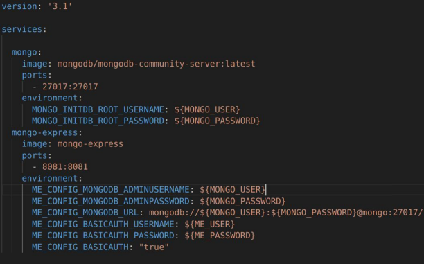

# MongoDB
MongoDB es una base de datos NoSQL de código abierto que se basa en documentos. A diferencia de las bases de datos relacionales tradicionales, que almacenan datos en tablas con filas y columnas, MongoDB almacene los datos en documentos BSON (una forma binaria de JSON).
Esta estrucutura de alamacenamiento permite mayor flexibilidad y escabilidad.
## Caracterísiticas de MongoDB:
1. **Modelo de documentos**: MongoDB utiliza un modelo basado en documentos, donde cada documento es similar a un objeto JSON y puede contener datos anidados. Esto permite represetar datos complejos y relacionados de manera natural.
2. Esquema flexible: MongoDB ofrece un lenguaje de consulta rico y expresivo que permite realizar búsquedas avanzadas, filtrado, clasificación, agrupación y más. También permite operaciones de agregación similares a las funciones de agrupamiento en base de datos relacionales.
3. **Consulta poderosa**.: MongoDB ofrece un lenguaje de consulta rico y expresivo que permite realizar búsquedas avanzadas, filtrado, clasificación, agrupación similares a las funciones de agrupamiento en bases de datos relacionales.
4. **Escalabilidad horizontal**: MongoDB soporta la división de datos (sharding) en múltiples servidores, lo que permite manejar grandes volúmenes de datos y cargas de trabajo distribuidas.
5. **Indices**: Al igual que en otras bases de datos, MongoDB permite crear índices en campos específicos para acaelerar las consultas y mejorar el rendimiento.
6. **Soporte para replicación**: MongoDB ofrece replicación integrada para garantizar las disponibilidad y durabilidad de los datos. Los datos pueden ser replicados en diferentes nodos para garantizar la continuidad del servicio en caso de fallas.
7. **Compatibilidad con múltiples lenguajes**: MongoDB tiene controladores disponibles para una amplia variedad de lenguajes de programación, incluidos JavaScript, Python, Java, C#, y otros, lo que facilita su integración en apliaciones.
## Instalación y configuración con Docker
Aunque se puede instalar de diferentes formas (local,nube,embedido,etc...), una de las formas más sencillas de utilizar, es a través de un contenedor Docker.

Existe una imagen Docker para MongoDB (verisón Community), para poder crear una instancia de forma sencilla, con el comando siguiente:

``` docker run --name mongodb -p 27017:27017 -d mongodb/mongodb-community-server:latest ```
También existe la opción de utilizar Docker Compose:

## Mongo Express 
Mongo express es una apliación web para poder conectar y administrar una instancia de MongoDb.

En esta apliación, se pueden realizar consultas e insertar documento.
Para realizar consultas en MongoDB, se utiliza JSON, por ejemplo ```{"numero":5}``` que quiere decir que se obtienen todos los documentos que tengan el atributo "numero" igual a 5.

## MongoDB Consultas
MongoDB, tiene las siguientes operaciones para trabajar con consultas JSON.
## PyMongo
pymongo es un paquete para el lenguaje Python, para poder conectarse a una base de datos MongoDB.

Para instalarlo, se utiliza el gestor de paquetes *pip*.

```
pip install pymongo
```
Con pymongo, podemos conectar a una instancia de MongoDB, con el siguiente fragmento:

```python
import pymongo
import json

myclient = pymongo.MongoClient("mongodb://rootexample@localhost:27017/")
mydb = myclient["asirdb1"]
mycol = mydb["packages"]
```

En este fragmento, nos conectamos a una instancia local y obtenemos tanto la base de datos y una colección.

### Insertar
Para insertar en una colección, puede utilizarse la función ```insert_one ()``` insertando un solo elemento (utilizando un diccionario o JSON).

Por otro lado, si queremos insertar varios elementos, podemos utilizar la función ```insert_many()``` pásandole una colección en JSON o diccionarios.

```python
file=open('packages.json')
j=json.load(file)
x = mycol.insert_many(j)
```

### Consulta 
Se puede obtener todos los objetos de una colección, utilizando la función find() esto devolvera un cursor, que podemos recorrer con un for.

```python
result = mycol.find ()
for n in result:
    print(n)
```
También puede utilizarse un diccionario o documento en JSON como consulta:
```python
query = {"address": "fake street, 123"}
result = mycol.find ()
for n in result:
    print(n)
```

### Modificar o Borrar
De igual forma, podemos modificar o borrar elementos utilizando las funciones ```update_one``` o ```delete_one``` (también está la version _many)

```python
update = {"address": "fake street, 123"}
mycol.update_one(query, newvalues)
#Borrar todos los elementos
mycol.delete_many({})
``` 
